# ZenFlow Pro 🌀🎛️

<p>
  
  
  
  
</p>

ZenFlow Pro is a next-generation, browser-based DJ Mixing application that allows you to control music filters, EQ bands, dynamic visualizers, and deck crossfades entirely through **webcam hand gestures**. By combining high-performance client-side computer vision with the professional Web Audio API, ZenFlow Pro constructs a futuristic, zero-touch performance interface.

> ⚠️ **DEVELOPMENTAL BUILD** — This project is in active development and may not work properly. The webcam hand-landmark tracking and Tone.js audio mapping are currently running in an experimental sandbox.

---

## ✨ Features

- **👋 Computer Vision Gesture Mixing:** Seamlessly maps your hand gestures (such as distance, finger spacing, and rotation) to hardware-like DJ controls in real-time.
- **🎵 Tone.js Signal Engine:** Houses a dual-deck audio signal system with independent channels, high/low-pass filters, delay lines, reverb engines, and professional crossfaders.
- **🎨 Glassmorphic Bold Zen Interface:** Formulated using custom glassmorphic styling, featuring interactive Rotary DJ Knobs that tilt and react dynamically to mouse-drag or webcam gesture controls.
- **📊 Real-Time Visualizers:** Renders gorgeous high-fps canvas audio wave grids and frequencies matching your audio outputs.
- **🔒 Private Web Inference:** Executes standard hand-landmark evaluation purely in your browser sandbox using Google MediaPipe — zero webcam data ever leaves your computer.

---

## 🧠 Hand Landmark Tracking & Audio Mapping

ZenFlow Pro maps spatial coordinates to standard DJ hardware controls:

1. **MediaPipe Tracking Engine:**
   - Evaluates a `21-point` hand-landmark coordinate system.
   - Calculates the palm vector to determine the hand's spatial tilt and rotation.
   - Normalizes raw coordinates to a float scale of `[0.0, 1.0]` relative to the camera viewport.

2. **DJ Parameter Mapping Matrix:**
   - **Left Hand Z-axis (Webcam Distance):** Controls Left Deck Filter Cutoff frequency (High-Pass/Low-Pass) mapped exponentially to align with human frequency curves (`40Hz - 20000Hz`).
   - **Right Hand Y-axis (Vertical sweep):** Controls Right Deck Volume gain.
   - **Pinch Gesture (Thumb to Index distance):** Toggles dynamic audio delay loops and echo trails.
   - **Both Hands distance (Horizontal separation):** Controls the crossfader ratio (`[-1.0 (Left), 1.0 (Right)]`).

---

## 🏗️ Signal Graph Architecture

```
        Webcam Video Frame ──► [ MediaPipe Hands API ]
                                       │
                                       ▼ (Normalized X, Y, Z coordinates)
                               [ State Bridge ]
                                       │
                    ┌──────────────────┴──────────────────┐
                    ▼                                     ▼
        [ Deck A Volume/Filters ]             [ Deck B Volume/Filters ]
        (Exponential AudioParam)              (Exponential AudioParam)
                    │                                     │
                    └──────────────────┬──────────────────┘
                                       ▼
                              [ Crossfader Node ]
                                       │
                                       ▼
                            [ Web Audio Destination ]
                               (Speakers & Visualizer)
```

- **AudioParam Smoothing**: To eliminate digital click sounds during rapid gesture sweeps, coordinates are passed using `.setValueAtTime()` or `.exponentialRampToValueAtTime()` with a custom time constant of `0.08 seconds`.

---

## 🚀 Getting Started

### Prerequisites
- **Node.js** v18+ and `npm`
- A functional webcam connected to your testing computer
- Standard browser with support for **WebAudio** and **WebRTC** (Chrome, Firefox, Safari)

### 💻 Local Setup & Development

1. **Clone the repository:**
   ```bash
   git clone https://github.com/Anuj-9009/zenflow-pro.git
   cd zenflow-pro
   ```

2. **Install all NPM dependencies:**
   ```bash
   npm install
   ```

3. **Start the Vite developer server:**
   ```bash
   npm run dev
   ```

4. **Open in browser:**
   Navigate to `http://localhost:5173`. Grant standard webcam permissions, drag a couple of audio files onto the deck bays, and start mixing completely hands-free!

---

<div align="center" style="margin-top: 40px;">
  
</div>
<p style="font-family: 'Sora', sans-serif; font-size: 13px; font-weight: 600; color: #38B2AC; margin: 0; text-align: center;">
  built by ANUJ with ❤️ to the hypnotic synths of the 1975's 'Somebody Else'
</p>
